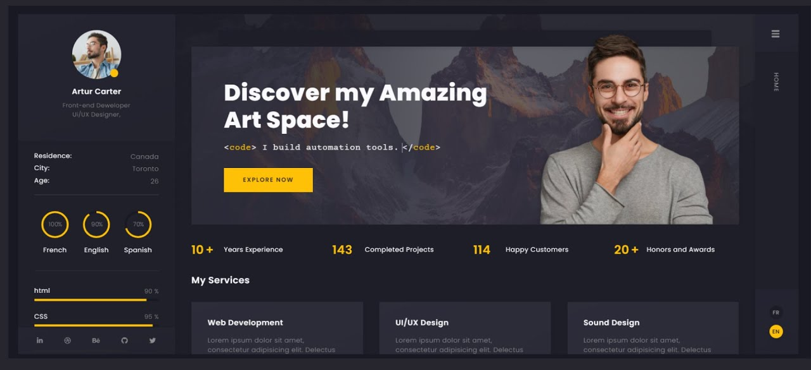

# My Portfolio

To make this project possible, I used HTML, CSS and javaScript.
Here is a quick recap of my method of approach:

## Part 1: Choosing The Design
I hoped for finding a dark themed layout of managable design and by browsing I was able to find one as shown below. 

## Part 2: Choosing the elements
To make the HTML clean code, I used nav, aside, main, header, section and span tags. I wanted different routes which I made them using `<a>` and `<template>` tags.

## Part 3: The HTML
I wrote the code sequentially by dividing each container one by one. The template tags doesn't display anything but can be used to insert its content into another using javaScript. I used svg tag to create the progress circle. This [link](https://stackoverflow.com/questions/66990496/simple-svg-css-progress-circle) helped me to achieve the svg progress circle. I also downloaded the icons from bootstrap and official sites. I also added the Resume because I felt the nav bar was a bit empty.

## Part 4: The CSS
The CSS is what makes this portfolio feel alive. With complementing dark gray and yellow colors, I was able to make a nice theme. To make the clicked button effect on the `<a>` tag, I used javaScript to add a class to the element which changes the background color. To make the content design, I used flex with flex, flex-shrink, flex-grow and flex basis. I also added a custom scrollbar with the webkit styles applied to the root using track and thumb components of the webkit scrollbar. I also discovered that the !important specification in the external css overrides the other css methods.

## Part 5: Responsiveness

Using flex wrap along with media query I was able to make it responsive till the small mobile view. Because of not enough space to display the about tab (aside tag), I hid it and made another route appear on the nav bar (About page). Because of this, I also had to automatically make it reappear when the window resizes.

## Part 6: javaScript

In this project I had to use javaScript to do some simple tasks like url routing so that I can correctly highlight the button click effect and some event listeners.